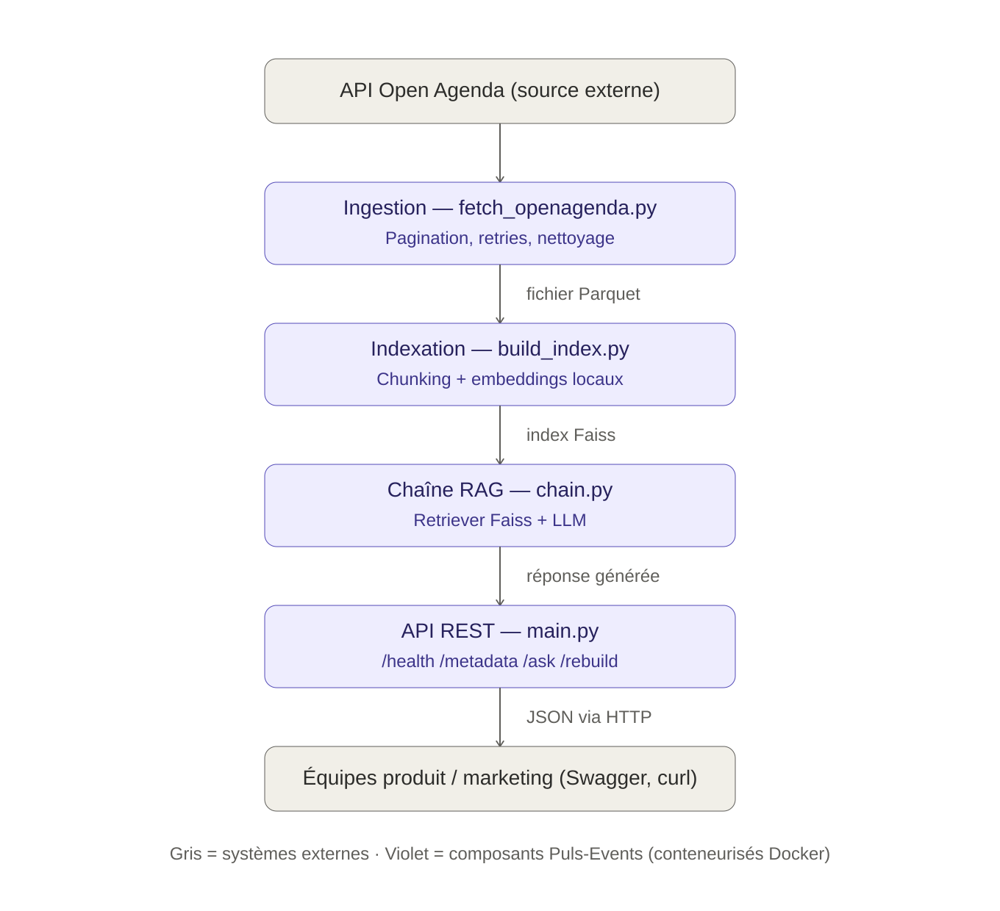

# Architecture du système RAG Puls-Events

Le schéma vectoriel source est disponible dans `architecture.svg` (modifiable, réutilisable dans le rapport technique ou la présentation PowerPoint).

## Flux de données

Le système est organisé en couches séquentielles, chacune correspondant à un module du dépôt. Les données circulent du haut (source externe) vers le bas (consommation par les équipes métier).

### 1. Source externe — API Open Agenda
Plateforme ouverte fournissant les événements culturels bruts (titre, description, dates, localisation). Filtrée sur une zone géographique (Bordeaux / Nouvelle-Aquitaine) et une fenêtre temporelle (< 1 an).

### 2. Ingestion — `src/data/fetch_openagenda.py`
Récupère les événements depuis l'API avec :
- **Pagination automatique** (au-delà de la limite de résultats par page) ;
- **Retries avec backoff exponentiel** en cas d'erreur réseau ou HTTP 5xx/429 (via `tenacity`) ;
- **Encodage sécurisé des paramètres** (échappement des guillemets dans les filtres) ;
- **Nettoyage** : suppression des doublons et des champs obligatoires manquants ;
- **Enrichissement** : normalisation des noms de ville, extraction des coordonnées GPS, indicateur de complétude de la localisation.

Sortie : un fichier `data/raw/events_raw.parquet`.

### 3. Indexation — `src/indexing/build_index.py`
Transforme les événements nettoyés en index vectoriel :
- **Chunking** des descriptions longues (`RecursiveCharacterTextSplitter`, 500 caractères, overlap 50) ;
- **Vectorisation** via un modèle d'embeddings Hugging Face local (`sentence-transformers/all-MiniLM-L6-v2`), gratuit et sans clé API ;
- **Construction et persistance** de l'index Faiss (`data/faiss_index/`).

### 4. Chaîne RAG — `src/rag/chain.py`
Cœur du système, orchestré avec LangChain (LCEL) :
- Le **retriever** interroge l'index Faiss et retourne les *k* documents les plus proches sémantiquement de la question ;
- Le **prompt** assemble ces documents comme contexte et la question de l'utilisateur ;
- Le **LLM** (configurable via `RAG_LLM_PROVIDER`) génère la réponse finale :
  - `nvidia` : API NVIDIA NIM (gratuite avec clé personnelle), catalogue de 100+ modèles ouverts (Llama, DeepSeek, Nemotron...) ;
  - `huggingface_local` : modèle open-source exécuté localement, sans clé API.
- Un garde-fou dans le prompt limite les hallucinations : si le contexte ne permet pas de répondre, le modèle l'indique explicitement.

### 5. API REST — `src/api/main.py`
Expose la chaîne RAG via FastAPI :

| Route | Méthode | Rôle |
|-------|---------|------|
| `/health` | GET | Vérifie que l'API répond |
| `/metadata` | GET | Renvoie l'état de l'index (nombre de vecteurs) et le fournisseur LLM actif |
| `/ask` | POST | Envoie une question, reçoit une réponse augmentée |
| `/rebuild` | POST | Reconstruit l'index Faiss à chaud |

Documentation interactive générée automatiquement (Swagger UI sur `/docs`).

### 6. Consommation — équipes produit / marketing
Les équipes testent le système via Swagger UI, `curl`, Postman ou tout client HTTP, sans connaissance technique du RAG sous-jacent.

## Couches transverses (non représentées sur le schéma)

- **Conteneurisation (Docker)** : l'ensemble des couches 2 à 5 est empaqueté dans une seule image Docker, exécutable localement via `docker compose up`.
- **Intégration continue (GitHub Actions)** : à chaque push, la CI installe les dépendances, exécute la suite de tests unitaires et fonctionnels, puis lance l'évaluation automatisée du RAG (similarité sémantique + métriques Ragas) si une clé API est disponible.
- **Tests et évaluation** : chaque couche dispose de tests unitaires dédiés (`tests/test_fetch_openagenda.py`, `tests/test_build_index.py`, `tests/test_chain.py`, `tests/api_test.py`), tous mockés pour ne dépendre d'aucun service externe.
